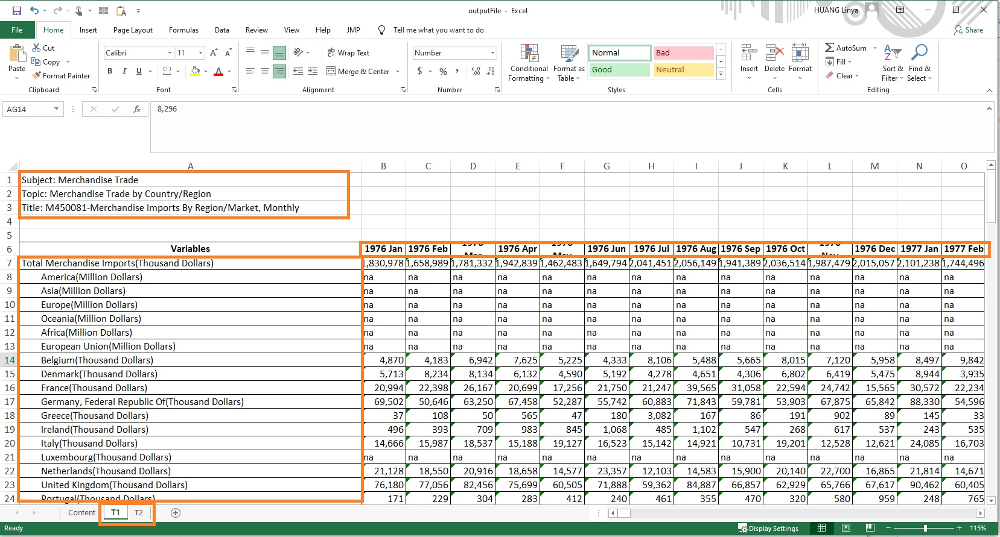

```{r setup, include=FALSE}
knitr::opts_chunk$set(echo = FALSE)
```

# 1. Introduction

In this data visualization makeover, I will apply interactive techniques in tableau to make an animated dashboard.

The original design is from [Department of Statistics, Singapore](https://www.singstat.gov.sg/modules/infographics/singapore-international-trade)

{width=60%}


# 2. Asessment of Clarity and Aesthetics in Original Design

**Clarity**


1. **Misleading circle presentation** By applying total trading value as size, some countries have circle occupying both net importers and net exporter areas, hence the roles of counties around diagonal area is not very clear. 

2. **No key insights annotation** The only key insights reader get at the first glance is the top net importer/exporter countries with marked star and animated arrows, but more insights should have been derived from the visualization.

3. **Notes Discrepancy** Meanwhile, the only note in the bottom describes the information of China and US since 2009 and 2006, which mismatches the main visualization showing trading value of 2020.

3. **Unclear x-y axis label** The label of both axis should be moved to right and top respectively, although it has been differentiated by 2 colors, putting them together at the zero point is not a wise choice. And currency unit should also been added in both axis.


**Aesthetics**


1. **Poor use of color** There are 10 different solid circles with white dot center representing countries, as well as 2 different colors representing background and axis ticks in the chart, making the whole design too colorful for professional business/economy data presentation. Also, the blue and green globe circle is redundant for axis labels.

2. **Crowded labels and circles** Due to the crowded design, some circles and labels are overlapping with each other and some currency label is missing. Besides, some label are even exceeded the main chart. This is a very poor use of scatter plot and labels. 

3. **Poor Animation** The design of flashing up/down arrow in the stars is meaningless. In addition, when hovering mouse to countries, the vibration does not provide additional insights at all.

**Suggestions to based on original design**

1. **Improvement of color and scatter circle** Try to apply fewer kinds of  color to represent importer and exporter countries, and remove background color and circle for axis label. Revise opacity of circle and add boarder to avoid overlap area and distinguish countries.

2. **Fine-tune text elements** Revise labels and title and add key insights.

3. **Remove meaningless animations** Remove all unnecessary animations in the chart.

# 3. Alternative Design Sketches and Published Dashboard


To overcome the issues discussed above, here is my proposal of design sketches. 


In the alternative design, I plan to use three graph charts. 

__Scatter Plot__ 

Inspired by [Viualization from  Esteban Ortiz-Ospina and Nicolas Lippolis 2017](https://ourworldindata.org/growth-and-structural-transformation-are-emerging-economies-industrializing-too-quickly), to show two dimension comparison of time series data, I would like to track the trajectory path of Import and Export value on a scatter plot with year as path and dot as values. I will make the dot small to avoid overlapping as much as possible. Then, by dragging the year slicer on top of the chart, the user can see a clear yearly evaluation path of specific country. In terms of color usage, I will only use 2 colors to differentiate importer and exporter roles for dot label, so that the chart won't be very crowded and colorful for business presentation.


__Slope/Line Chart__ 

I will add another slope/line chart right next to the scatter plot to provide a quick and clear overview that how import/export/total trading/net export value has been changed throughout the selected period. I will use diverging colors to highlight countries with high values in dark blue and 'hide' those with low values in light gray colors. The clear absolute dollar values and % change trend in slope/line graph will be a good supplement to the scatter plot. 


__Country List__ 

A country list by select measure ranking will be add to the right of the dashboard, so that user can select or hover to any country and highlight in both charts. This can help solve the poor animation problem discussed above and make the chart more interactive.


__Interactive Approach__

  •1. A year slicer will be added into the table for user to select different year period. 
  •2. Region, line/slope graph and select measure will be added as filter so that user can focus on desired focal.
  •3. Ideally, when hovering mouse to any of trajectory (in scatter plot), line (in slope/line graph) or country (in country list), other visualization will show the highlighted objectives and 'hide' others.


__Clarity__

  •Clear Year Pattern-By using year path and dot presentation, the value will be clearly represented.
  •Added title and key insights-Title will be tuned and insights will be added so that reader can get the important message at the first glance.
  •Revised Axis Labels-Currency unit will be added to axis labels.

__Aesthetics__

  •Suitable Color Presentation for Business Purpose- background color will be removed from original design and fewer color will be applied in the new design.
  •Clear Labels and Numbers and no Overlapping- Values and changes during the period will be presented more clearly and misleading overlapping area will be avoided.
  •Interactive Slicer,Filter and Highlighter- Users will have multiple selection for different focal and the values will be highlighted across charts with simple click or hover.


The final look of the data visualization makeover is  available in [Tableau Public](https://public.tableau.com/app/profile/linya.huang/viz/Data_Makeover2/Dashboard1).


# 4. Tableau Tutorial Step-by-Step

## 4.1 Data Preparation in Tableau Prep

The data is downloaded from sub-section of [Merchandise Trade by Region/Market](https://www.singstat.gov.sg/find-data/search-by-theme/trade-and-investment/merchandise-trade/latest-data). Let's download the file to local drive, unzip and open it.

Noted the raw data has 3 tabs, content, T1(import) and T2(export). In both T1 and T2, top 3 rows consists introduction of data and followed by countries/ continents variables , currency unit and values from 1976 January till 2021 March.


__4.1.2 Load data to tableau Prep__

After understanding the raw data structure. Next, let’s launch Tableau Prep Builder and load data.

  •1.click Connect to Data button
  
  •2.select Microsoft Excel on the left bar
  
  •3.locate to target file folder 
  
  •4.confirm and click Open


__4.1.3 Check Data Interpreter__ 

After loading the data, the excel sheets will appear on the left side bar. Then check the box of Use Data Interpreter so that tableau can help to clean the excel workbook , for example, to remove the top 3 rows introduction and locate to the main table in the sheet.


__4.1.4 Initialize Workspace__

  - 1. Drag sheet T1 into work space.
  - 2. Click the round “+” button next to T1
  - 3. Click add Clean Step.


__4.1.5.  Remove Non-target Date Columns__

Since we are only interested in date period from 2011 and 2020, let’s remove those non-target period following the steps below.

  + 1. click show list view
  + 2. select non-target date columns by pressing ‘shift’ key on the keyboard
  + 3. right click and select remove
  


__4.1.6.  Split Currency and Country Name__

Noticed that Variables column does not follow the same pattern, as some of the coutries has two parentheses in the colunmn, such as Slovak Republic (Slovakia)(Thousand Dollars). Therefore, to split them, a few steps are performed as below.

  + 1. TRIM( SPLIT( [Variables], "(", 1 ) )
  + 2. TRIM( SPLIT( [Variables], "(", 2 ) )
  + 3. TRIM( RIGHT([Variables], if(FINDNTH([Variables],"(", 2) > 0) then LEN([Variables]) - FINDNTH([Variables],"(", 2) - LEN("(") + 1 else 0  end) )
  + 4. TRIM( SPLIT( [Variables - Split 2], "Dollars", 1 ) )
  + 5. TRIM( SPLIT( [Variables - Split 3], " ", 1 ) )
  + 6. IF [Variables - Split 2 - Split 1] != "Thousand" AND [Variables - Split 2 - Split 1] != "Million" THEN [Variables - Split 3 - Split 1] ELSE [Variables - Split 2 - Split 1]END
  + 7. IF [Variables - Split 3 - Split 1] ="Thousand" THEN [Variables - Split 1]+"("+[Variables - Split 2 - Split 1] ELSE [Variables - Split 1] END
  + 8. Remove the intermediate columns and leave the relative country and currency only.


__4.1.7.  Filter Country__

Filter out continents and header 'Total Merchandies Imports' by clicking Country variable >> Filter by selected value


__4.1.8.  Add Pivot Step and Get a Pivot Table__


  •1. Click on the ‘+’ button next to 'Clean 1' step at the work space area and selecting Pivot option.
  
  •2. Select Columns to Rows option and drag all dates to Pivot Fields.
  

__4.1.9.  Calculate Values__

Create Calculated Field by inputting the formulas below.
  
  
__4.1.10.  Rename and Remove Variables__

  •1. Then Remove the calculate columns as Values(Import) , [Pivot 1 Values] by selecting the field and clicking remove option
  •2. Rename [Pivot Names] to [Date]
  •3. Remove [Currency Unit] field
  

  

__4.1.11.  Repeat and join T1 and T2__

  •1. Repeat the same steps for table T2(Export data) as we just did for T1
  •2. Drag T2 to T1 to join two tables


__4.1.12. Table Join Rules__

  •1. Applied 'Date' and 'Country' Join Clauses
  •2. Choose the full join type
  
{width=40%} 

__4.1.13. Add Calculated Fields__

Then, let's create 2 calculation filed as below,

"Net Export=[Values (Export)]-[Values (Import)]"

"Total Trading Values=[Values (Export)]+[Values (Import)]"

{width=80%} 

__4.1.14. Download Standard country statistical use table__

In order to enable country and region selection in the final design, I downloaded the standard country statistical use table online.

According to Department of Statistics, Singapore-[International Classifications](https://www.singstat.gov.sg/standards/international-classifications), the [Standard country or area codes for statistical use (M49)](https://unstats.un.org/unsd/methodology/m49/) is applied for country and region mapping. 

Download the [excel file](https://unstats.un.org/unsd/methodology/m49/overview/) from the website. 

Select 'Region Name' and 'Country or Area' two columns as highlighted in Figure 4.1.14.


__4.1.15. Import UNSD Table and Map Country and Region__

Import table into the work space and join with the cleaned data generated from above steps.

Input 'Country'='Country' as applied join clauses. 


__4.1.16. Clean Jion2 Data__

  •1. Remove duplicated Country-1 Variable
  •2. Create calculated field "Year=YEAR([Date])"
  •3. Remove Date Column
  •4. Filter Countries Yamen Democratic and Germany, Democratic Republic Of with no value during the period
  

__4.1.17. Aggregate Data by Year__

  Since we are only interested in the long term period time, let's add another aggregate step following Clean 3 Step.
  
  Drag Country/Year/Region to the left aggregated panel and numerical values to the right panel.
  


__4.1.18. Output Cleaned Data__

Move on to the last clean data step, add output step to get the tableau file.

  •	1. Click on Browse
  
  •	2. Locate to the file location, change the File name
  
  •	3. Click Run Flow button to get the tableau output file
  

  
## 4.2 Data Makeover in Tableau Desktop


__4.2.1. Import Cleaned Data into Tableau Desktop__

Drag the cleaned data into Tableau Desktop


__4.2.2. Create Parameters__

  •1. Right click blank area and select create parameters
  •2. Create two parameters as shown in the figure 4.2.2
  
  
__4.2.3. Create Calculated Field for Parameters__

  •1. Right click blank area and select create calculated field
  •2. Create two calculated field 'Select Measure' and 'Line/Slope Toggle' as shown in figure 4.2.3
  
  

__4.2.4. Slope Chart - Columns, Rows and Filters__

  •1. Drag Years to Columns, Select Measure to Rows
  •2. Double click blank ares next to select measure and input formula 'MIN(1)'
  •3. Drag 'Country','Region' and 'Line/Slope Toggle' to Filters
  
   

__4.2.5. Slope Chart - Dual Axis Bar Chart__

  •1. Make 'Min(1)' as dual axis
  •2. Change the Marks type to Bar
  •3. Double click 'Min(1)' axis and change the range type to 'Fixed' 0-1

   

__4.2.6. Slope Chart- Format Size and Color__

  •1. Change the size of the bar to minimum
  •2. Update color of 'MIN(1)' and 'Select Measure' Variables

  

__4.2.7. Slope Chart- Chart Detail and Color Format__

  •1. Change mark 'Select Measure' as Line
  •2. Drag 'Country' as detail and 'Select Measure' as color options under mark
  •3. Edit color into custom diverging with 5 steps
  

  

__4.2.8. Slope Chart- Add labels__

  •1. Add 'Country','Select Measure' to label
  •2. Format labels with no decimal and prefix '$'
  
  


__4.2.9. Slope Chart- Add % of Change Labels for Year End1__

Create '% change' and '% change label' calculation fields.
  
  

__4.2.10. Slope Chart- Add Left Labels and Parameters__

  •1. Add '% change label' as label
  •2. Click Label and check Label start/end of line 
  •3. Right click parameters and check Show Parameter
  
  
__4.2.11. Scatter Plot - Columns and Rows __

  •1. Drag 'Export' to columns and 2 'Import' to rows
  •2. Make 'Import'dual axis and uncheck show headers
  
  

__4.2.12. Scatter Plot - Create Calculation Field __

Create a calculation field to differenciate trade dificit and trade surplus.
  
  

__4.2.13.  Scatter Plot - Create Path__

  •1. Change the types of 'SUM(Import)(2)'marks as Line
  •2. Drag 'Country' as detail and label option under Marks
  •3. Drag 'Year' as path option under Marks and change the color to gray
  
    

__4.2.14.  Scatter Plot - Create Dot__

  •1. Change the types of 'SUM(Import)(2)'marks as Circle
  •2. Drag 'Country' as detail,'Importer/Exporter' as color, 'Year' as Label, 'Select Measure' as size and tooltip
  •3. Change the color of 'Trade Deficit' and 'Trade Surplus'
  
   
__4.2.15.  Country List__

Let's create another worksheet as a country list selection panel.

  •1. Create another calculation field called 'Rank' as shown in Figure 4.2.15. as below
  •2. Drag 'Country' to rows and 'Year','Region','Country' to filters as well
  •3. Drag 'Rank' as label under marks

  
__4.2.16. Country List__
Let's create another worksheet as a country list selection panel.

  •1. Create another calculation field called 'Rank' as shown in Figure 4.2.15. as below
  •2. Drag 'Country' to rows and 'Year','Region','Country' to filters as well
  •3. Drag 'Rank' as label under marks


__4.2.16. Dashboard Layout__


  •1. Create a dashboard sheet 
  •2. Place charts, filter,legend to the dashboard 
  •3. Add Text and Blank objects with layout shown as below


__4.2.17 Create Highlight Action__

To make the dashboard more interactive and highlight the country in both charts when selecting or hovering mouse, please follow the steps below.
  •1. Click dashboard >> actions on the menu bar
  •2. Create 1 filter and 2 highlight actions as shown in Figure 4.2.17


__4.2.18 Check the Country List as Filter__

Click 'More Options' of the country list chart and check 'Use as Filter' Option.

By doing so, when user select countries on the right country list filter, the country will be highlighted in both charts.


{width=20%}

__4.2.19 Format Text Title__

Double Click the text to edit. Below is the sample of how parameters are added, such that when switching between select measure, the title of the text will change accordingly.


__4.2.20 Add Animation__

To make the dashboard more intersting, lets add animation function in the chart to show the changing path.

  •1. Click Format >>Animations
  
  •2. Click On and change the duration to 2.0 seconds


**Bravo! We have completed the dashboard!**

[Tableau Public](https://public.tableau.com/app/profile/linya.huang/viz/Data_Makeover2/Dashboard1).


# 5. Major Observations 


  •1.With the selection of 'Total Trading', 'Line Graph', 'All Region' and top 10 countries highlighted, we can find the 10 years trading patterns. Of 10 top trading countries, 9 of them are from Asian region except United States. Mainland China exceeded Malaysia in year 2013 and becomes Singapore largest trading partner, increasing to S$136B with 33% by the end of year 2020. Meanwhile, in year 2016, half of the top 10 trading partners -Mainland China, Malaysia, US, Indonesia and Republic of Korea- experienced a sudden drop in total trading values. When switching the graph option to 'Slope', it is observed that largest % of total trading comes from Taiwan (+64%) and United (+35%), while India (-44%) and Indonesia(-40%) in the opposite.

  •2. Selecte'Net Export', 'Slope Graph' for right chart. In the largest Asian markets, Hong Kong is the biggest net exporter of Singapore all time with over \$S50B dollars and increased 11% during the time. While other former leading exporters such as Malaysia and Indonesia, the net export value has dropped significantly, especially Malaysia has become Singapore's net importer by end of year 2020 at -\$12B dollars. For Singapore merchandise importers, Taiwan is taking the leading position in year 2020 as its import values increased about 2 times as shown in the left graph (y-axis).
  


  •3. For other regions, such as  American Regions, United States net export value increased from bottom position to the top among other countries in the region (at S\$6B +127%) in year 2020. As shown in the trajectory graph, the export value with United States has increased about 2 times during the period.
  
  

  For Europe Regions, the import and export values fluctuates significantly with net export value range from -\$1B to \$2B, except for Netherlands and Belgium, of which the net export value has a stable increase and reached to \$11B and \$5B respectively in 2020.
  
   
  While for Oceania Regions, they all have merchandise trade surplus with Singapore. However,Australia, the largest trading partner of the region, has \$7B (-27%) drop in net export values mainly contributing by the shrinking of export volumes -\$8B. 
  
   

Thank you for reading up to this point! 


# Reference:


*Department of Statistics, Singapore. (2020)*. Retrieved from Merchandise Trade Performance with Major Trading Partners, 2020: https://www.singstat.gov.sg/modules/infographics/singapore-international-trade

Esteban Ortiz-Ospina, Nicolas Lippolis. (2017, October 30). *Our World in Data*. Retrieved from Are emerging economies deindustrializing too quickly?: https://ourworldindata.org/growth-and-structural-transformation-are-emerging-economies-industrializing-too-quickly

*International Classifications. (2021)*. Retrieved from Department of Statistics,Singapore: https://www.singstat.gov.sg/standards/international-classifications

Sleeper, R. (2021). *Playfair Data*. Retrieved from 3 Ways to Make Splendid Slope Graphs in Tableau: https://playfairdata.com/3-ways-to-make-splendid-slope-graphs-in-tableau/

*Standard country or area codes for statistical use (M49) Overview. (2021)*. Retrieved from UN - Statistics Division: https://unstats.un.org/unsd/methodology/m49/


