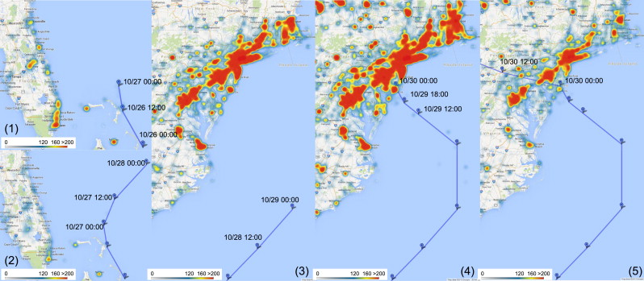
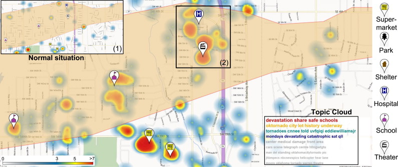
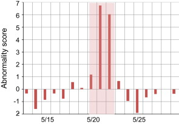
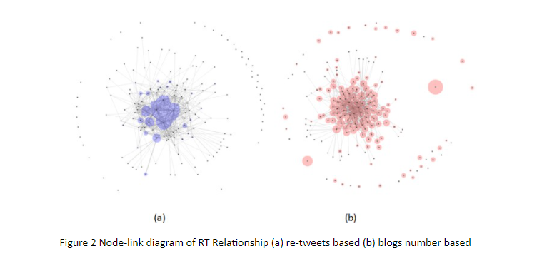

```{r setup, include=FALSE}
knitr::opts_chunk$set(fig.retina = 3,
  echo = TRUE,
                      eval = TRUE,
                      message = FALSE,
                      warning=FALSE)
```

# 1.Introduction

In this report, I will use visual analytics techniques in R to solve questions from [VAST Challenge 2021: Mini-Challenge 3](https://vast-challenge.github.io/2021/MC3.html). The main data set are 1)microblog records that have been identified by automated filters as being potentially relevant to the ongoing incident and 2)text transcripts of emergency dispatches by the Abila, Kronos local police and fire departments.

# 2.Literature Review

Detecting abnormal events ,such as disaster or crisis, from microblog social media has become a trend, as social media has played a pervasive role in the way people behave and think. Nowadays, people are also using time-stamped , geo -located data to share live information about what's happening in their surroundings, which enables the public, government and researches to sense abnormal events in community more quickly and take immediate actions.

## Spatiotemporal Abnormal Detection
The study from Junghoon et al. (2014) applied spatiotemporal visualization of microblog data to detect disaster and support decisions. The visualization they applied are shown as below,



The number of Twitter users who posted Twitter messages containing one of the following keywords: hurricane, storm, and sandy is highly related to Hurricane Sandy (as shown in blue pins and blue lines of the center locations)

Then their study also analyzed spatial pattern of Twitter users after the tornado.



(1)the heatmap shows a normal situation of Twitter user distribution in the same area of which the distribution is very different from the situation after the tornado event. As such, the spatial analytics can help with disaster management according to twitter heatmap distribution.

Besides, the abnormality score are calculated with Latent Dirichlet Allocation (LDA) topic modeling and Seasonal-Trend Decomposition to detect severe weather condition.


{ width=50% }

Given the limitation of MC3 data set, we cannot visualize spatial heatmap, but we can try to leverage on LDA modeling and abnormality detection methodology to detect the crisis in Abila community. 


## Junk/Spam Detection

In [Visual Analytics Benchmark Repository 2014](http://visualdata.wustl.edu/varepository/VAST%20Challenge%202014/challenges/MC3%20-%20Real-Time,%20Streaming%20Social%20Media/), the submission from [Tianjin University](http://visualdata.wustl.edu/varepository/VAST%20Challenge%202014/challenges/MC3%20-%20Real-Time,%20Streaming%20Social%20Media/entries/Tianjin%20University/) demonstrated a network approach in identifying junk tweet.


They think "the size of the nodes represents the number of the blog being post. Notice that there are several nodes which have the larger size but no relationship with others which means theirs blogs are ignored by others.". This is a very good intuition to visualize center and edges microblog user. 

However, if we can consider the correlation of text in two blogs would be better.

## Relationship or text and text entities visualization

[Textnets](https://github.com/cbail/textnets) is a R package for automated text analysis using network techniques.It provides network for both text and text entities, which provides visualization ability to uncover correlation of texts in documents.

 { width=70% }

This visualization can be applied in the question 2 in answering the potential consequences of the situation and the number of people who could be affected via network graph.


# 3.Data Preprocessing and Exploratory

## 3.1 Import packages and social media stream data

```{r}
packages= c('raster','sf','clock','tmap',
            'tidyverse','data.table','lubridate',
            'textclean','tm','wordcloud','wordcloud2','text2vec',
            'topicmodels','tidytext','textmineR','quanteda',
            'BTM','textplot','concaveman','ggwordcloud',
            'qdapDictionaries','textstem','devtools','textnets',
            'ggiraph','plotly','igraph', 'tidygraph', 
             'ggraph', 'visNetwork','udpipe')

for(p in packages){
  if(!require(p,character.only= T)){
    install.packages(p)
    }
  library(p, character.only = T)
}
```
```{r}
#install.packages("devtools")
#install_github("cbail/textnets")

```


```{r}
#read csv file
data_17_1830=read_csv("data/MC3/csv-1700-1830.csv")
data_1830_20=read_csv("data/MC3/csv-1831-2000.csv")
data_20_2130=read_csv("data/MC3/csv-2001-2131.csv")

#append 3 dataset

data=rbindlist(list(data_17_1830,data_1830_20,data_20_2130))

#print head of data
head(data)

```
 

## 3.2 Change date type

```{r}

#timestamp in lubridate
data$timestamp <- ymd_hms(data$`date(yyyyMMddHHmmss)`)

data$time_1min = cut(data$timestamp, breaks="1 min")

```

 
 
## 3.3 Text Data Preprocessing

```{r}
rt <- "RT @([A-Za-z]+[A-Za-z0-9_-]+)(?![A-Za-z0-9_]*\\.)"
ppl <- "@([A-Za-z]+[A-Za-z0-9_-]+)(?![A-Za-z0-9_]*\\.)"
hash <- "#([A-Za-z]+[A-Za-z0-9_]+)(?![A-Za-z0-9_]*\\.)"

data$cleaned<-data$message %>% 
  str_replace_all(rt,"")%>%
  str_replace_all(ppl,"")%>%
  str_replace_all(hash,"") %>% 
  tolower()%>%   # transform all message to lower cases
  replace_contraction()%>%   #replace contractions with long form
  replace_word_elongation()%>% #remove the same letter (case insensitive) appears 3 times consecutively
  str_replace_all("[0-9]", "") %>% #removing numbers
  str_replace_all("([,=!.?$+%-&])","")%>% #remove punctuations
  #str_replace_all("rt|pokrally|kronosstar","")%>%
  #|#hi|#pok|#pokrally|
  # #abilapost|#kronosstar|#centralbulletin|@centralbulletin|@kronosstar|rally|aliba") #remove hashtag and rt
  removeWords(stopwords("english"))%>% 
  str_squish()%>% #trim whitespace from a string 
  lemmatize_strings()#removes whitespace from start and end of string

#head(subset(data,select=c("message","cleaned")))


```

Retrieve RT/ hashtags from message
```{r}
regex <- "RT @([A-Za-z]+[A-Za-z0-9_-]+)(?![A-Za-z0-9_]*\\.)"
regex2 <- "@([A-Za-z]+[A-Za-z0-9_-]+)(?![A-Za-z0-9_]*\\.)"
regex3 <- "RT @([A-Za-z]+[A-Za-z0-9_-]+)(?![A-Za-z0-9_]*\\.) "
regex4 <- "#([A-Za-z]+[A-Za-z0-9_]+)(?![A-Za-z0-9_]*\\.)"

data$RT_pattern<-str_extract_all(data$message, regex, simplify = TRUE)
data$RT_from<-  str_extract_all(data$RT_pattern, regex2, simplify = TRUE)
data$RT_from<-  str_replace(data$RT_from, "@","")
data$RT_message <- str_replace_all(data$message,regex3,"")

data$hashtag <- str_extract_all(data$message, regex2, simplify = FALSE)
data$user_mentioned <- str_extract_all(data$message, regex4, simplify = FALSE)


data_RT<- data %>% 
  filter(RT_from!="")

#head(data)
```

 
```{r}

#convert dataframe to corpus
docs <- Corpus(VectorSource(as.character(data$cleaned)))

inspect(docs[1:2])

# Create a document-term-matrix

dtm <- TermDocumentMatrix(docs) 
matrix <- as.matrix(dtm) 
words <- sort(rowSums(matrix),decreasing=TRUE) 

# words and frequency dataframe
df <- data.frame(word = names(words),freq=words)

#word cloud
wordcloud(words = df$word, freq = df$freq, min.freq = 5,           max.words=200, random.order=FALSE, rot.per=0.35,            colors=brewer.pal(8, "Dark2"))
#wordcloud2(data=df, size=1.6, color='random-dark')

```


```{r}

#as_datetime(data$time_1min)
data$timestamp <- ymd_hms(data$`date(yyyyMMddHHmmss)`)
data$time_30min = cut(data$timestamp, breaks="30 min")
data$id <- seq.int(nrow(data))

data_subset=subset(data,select=c("time_30min","cleaned"))

```


# 4.Data Visualization for Challenge Questions


## 4.1 Using visual analytics, characterize the different types of content in the dataset. What distinguishes meaningful event reports from typical chatter from junk or spam? Please limit your answer to 8 images and 500 words.


First the data is split by 30 minutes time interval and perform wordcloud, to visualize the most frequent words in the microblog.


```{r,fig.width=8, fig.height=8}

data$timestamp <- ymd_hms(data$`date(yyyyMMddHHmmss)`)
data$time_30min = cut(data$timestamp, breaks="30 min")
data$id <- seq.int(nrow(data))

data_subset=subset(data,select=c("time_30min","cleaned"))


usenet_words<-data_subset%>%
  group_by(time_30min) %>% 
  unnest_tokens(word, cleaned) %>%
  count(time_30min,word, sort = TRUE)


usenet_words[order(usenet_words$time_30min),]


set.seed(1234)
usenet_words %>%
  group_by(time_30min) %>% 
  slice_max(order_by = n, n = 20) %>% 
ggplot(aes(label = word,
           size = n)) +
  geom_text_wordcloud() +
  theme_minimal() +
  facet_wrap(~time_30min)
```

From the visualization, we can tell the main content discussing in the community are

1700-1830 pok rally in park with several name mentioned such as cylvia, jakab, viktor
1830-1930 fire at dancing dolphin partment, police and evacuation.
1930-2000 shooting and cops/police
2100-2130 van/ hostage/ explosion


Then, by applying Term Frequency – Inverse document frequency (tf-idf) to bigram texts, we can uncover more information compared with unigrams. 

```{r,fig.width=12, fig.height=10}


bigrams <- data_subset%>%
  group_by(time_30min)%>%
  unnest_tokens(word, 
                cleaned, 
                token = "ngrams", 
                n = 2) %>%
  count(time_30min,word, sort = TRUE)


tf_idf <- bigrams%>%
  bind_tf_idf(word,time_30min, n) %>%
  arrange(desc(tf_idf))

tf_idf %>%
  group_by(time_30min) %>%
  slice_max(tf_idf,
            n = 10) %>%
  ungroup() %>%
  mutate(word = reorder(word,
                        tf_idf)) %>%
  ggplot(aes(tf_idf,
             word,
             fill = time_30min)) +
  geom_col(show.legend = FALSE) +
  facet_wrap(~ time_30min,
             scales = "free") +
  labs(x = "tf-idf bigram",
       y = NULL)
```


Without having to process more on data, the contents of the microblogs with 30 mins time interval is even more informative.
For instance, from 1700-1800, we know that police presense at pok rally and Dr. Audrey is mentioned several times from 1800. Then from 1830 , fire occurs at dolphin apartment and followed by evacuation. Then, from 1930, a shot/gun fire happened with police involved, followed by injured firefighter and  hospitalization. And from 2100 suspects were arrested and followed by an explosion at dolphin apartment from 2130 onward. 


Then, to distinguish meaningful events from chatter/junk/spam messages, I will then perform topic modeling to identify topic in each microblogs.


```{r}
wordcorpus <- Corpus(VectorSource(as.character(data$cleaned)))  
dtm <- DocumentTermMatrix(wordcorpus,
                          control = list(
                            wordLengths=c(2, Inf),               # limit word length
                            bounds = list(global = c(5,Inf)),    # minimum word frequency
                            removeNumbers = TRUE,                #remove Numbers
                            weighting = weightTf,                #weighted term frequency
                            encoding = "UTF-8"))

rowTotals <- apply(dtm , 1, sum) #Find the sum of words in each Document
dtm.new   <- dtm[rowTotals> 0, ] #remove 0 dtm rows of matrix

topic=LDA(dtm.new,k=10,method="Gibbs",conrol=list(seed=2021,alpha=0.01,iter=200))
```


Top five words in each topics

```{r}
terms(topic,5)

```

Extract per-topic-per-word probabilities ,β(“beta”), from the model. The higher the value, the more important of the words to the topic.


```{r,fig.width=12, fig.height=10}
ap_topics <- tidy(topic, matrix = "beta")


ap_top_terms <- ap_topics %>%
  group_by(topic) %>%
  slice_max(beta, n = 10) %>% 
  ungroup() %>%
  arrange(topic, -beta)

ap_top_terms %>%
  mutate(term = reorder_within(term, beta, topic)) %>%
  ggplot(aes(beta, term, fill = factor(topic))) +
  geom_col(show.legend = FALSE) +
  facet_wrap(~ topic, scales = "free") +
  scale_y_reordered()
```
As shown above, the meaningful keywords can be found in each topic.

Topic 1 - police related as words mentioning police/standoff/crowd 

Topic 5 - several pok leaders are mentioned

Topic 6 - resident evacuation and hostages

Topic 9 - fire at dancing dolphin

topic 10- van/ shoot/ guy

While other topics are more chatter/junk related.


By using gamma, we can then assign each document with a topic。

```{r}
topic_gamma <- tidy(topic, matrix = "gamma")
topic_gamma <- topic_gamma %>% 
  group_by(document) %>% 
  slice(which.max(gamma))

topic_gamma$document<-as.numeric(topic_gamma$document) 
#topic_gamma[order(topic_gamma$document),] %>% group_by(topic) %>% count() 
#(topic_gamma%>% arrange(desc(-document)))

id_time <- data %>% select(c("id","time_1min"))

topic_data<-left_join(topic_gamma,id_time,by=c("document"="id"))

#manually put topics in LDA results

topic_c<- c(1,2,3,4,5,6,7,8,9,10)  
topics_c <- c("police related","chatter1","chatter2","chatter3","POK leaders",
"evacuation & hostages","chatter4","junk","fire","van")
topic_df<-data.frame(topic_c,topics_c )

topic_data<-left_join(topic_data,topic_df,by=c("topic"="topic_c"))

topic_data %>% group_by(time_1min,topics_c) %>% count() %>% 
  ggplot(aes(x=time_1min))+
  geom_bar(aes(y=n), stat = "identity",fill = "black")+
  facet_wrap(~topics_c)+
  theme(axis.title.x=element_blank(),
        axis.text.x=element_blank(),
        axis.ticks.x=element_blank())+
  ggtitle("Topics Trend from 1700-2130")
```

From the topic trend distribution, we can see that chatter topic 1-4 are spreaded all over the time period, and the number of junk posts are small and evenly distributed. While the peaks of key major events are very obvious at certain point of time. Through topic modeling techniques, we can identify major event from junk/chatter/spam, and thetopic trend visualization can help the audience know about temporal pattern of meanningful events distribution.


```{r,echo=FALSE}
#Tokenize data
tidytxtdata<- tidy(dtm)
                    
tidytxtdata <- tidytxtdata%>% #Remove the count column
  select(-count)
tidytxtdata <- tidytxtdata%>% #Change the column name 'term' to 'word' so that we can get rid of stopwords later
  rename(word = term)


#Remove stopwords
tidytxtdata <- tidytxtdata%>%
  anti_join(stop_words)


#Use the btm model
set.seed(321)
model <- BTM(tidytxtdata, k = 20, beta = 0.01, background = TRUE, iter = 500, trace = 100) #Run the model

topicterms <- terms(model, top_n = 10) #View the topics
#topicterms

library(textplot)
library(ggraph)
library(concaveman)
plot(model)
```


Then, let's take a closer look of the relationship of number of tweets and re-tweets from a single author. 

```{r}
tweet<-data %>%
  filter(author!="NA") %>% 
  group_by(author) %>%
  count() %>% 
  ungroup()

retweet<-data %>%
  group_by(RT_from) %>%
  count()%>% 
  ungroup()


colnames(tweet)[2]<-"tweet"
colnames(retweet)[2]<-"retweet"


tweet_retweet<-left_join(tweet, retweet, by = c("author"="RT_from"))

is.na(tweet_retweet$retweet)<-0

tweet_retweet$retweet_ratio<- tweet_retweet$retweet/tweet_retweet$tweet
tweet_retweet$tweet_scale <-scale(tweet_retweet$tweet)
tweet_retweet$tweet_scale <-as.numeric(tweet_retweet$tweet_scale)

fig<- plot_ly(data=tweet_retweet,
        x=~retweet_ratio,
        y=~tweet_scale,
        text= ~paste("Author:",author,
                     "Tweet:",tweet,
                     "Re-Tweet",retweet))

fig %>% layout(autosize = F, width = 100, height = 100)
fig
```

I calculaed the tweets and retweets numbers and retweets ratio of a single user and plot the retweet_ratio and tweet numbers(scaled value) as a scatter plot.

From the chart above, we can notice that user with number of tweets does not have any retweets, such as @Clevvah4Evah, @KronosQuoth are mainly posting junk/spam blogs. On the other hand, authors with high re-tweet frequency are HomelandIlluminations,
@AbilaPost, @KronosStar,  @CentralBulletin , @NewsOnlineToday , and @InternationalNews, of which the post were more active and meaningful information to the public.


##4.2 Use visual analytics to represent and evaluate how the level of the risk to the public evolves over the course of the evening. Consider the potential consequences of the situation and the number of people who could be affected. Please limit your answer to 10 images and 1000 words.

### Risk Level 

#### Number of posts 

```{r}
count <- data %>%
  group_by(type,time_1min) %>%
  summarise(count_of_posts= n_distinct(message))

count$time_1min=ymd_hms(count$time_1min)
#count$time_1min=format(count$time_1min,format = "%H:%M:%S") 

mean=mean(count$count_of_posts)

ggplot(count,aes(x=time_1min,y=count_of_posts,fill=type))+
         geom_bar(stat="identity",position="dodge")+
  # geom_abline(h=mean, col = "black")+
  theme(axis.text.x = element_text(angle = 90, hjust = 1))+
  ggtitle("Total Number of Posts through the period")

head(count[order(-count$count_of_posts),],10)
```

With time interval at 1 minute, the sum number of posts is plotted as above. The peaks of both ccdata and mbdata are observed during time 19:40-19:50, 18:45:00 and 20:10:00. 


####  Number of retweets/tweets

```{r}
data_rt2<-data %>% 
   #filter(str_detect(message, "fire")) %>% 
  select(c("author","time_1min","message","RT_from")) %>% 
  group_by(time_1min) %>% 
  summarise(post=n(),
            rt_post=sum(RT_from!=""))

data_rt2$time_1min=ymd_hms(data_rt2$time_1min)


#ggplot(fire,aes(x=time_1min,y=n))+
         #geom_bar(stat="identity",position="dodge")+
  #theme(axis.text.x = element_text(angle = 90, hjust = 1))+
  #ggtitle("Total Number of Posts through the period")


ggplot(data_rt2,aes(x=time_1min)) +
    geom_bar(aes(y=post), stat = "identity",fill = "red") +
    geom_bar(aes(y=rt_post), stat = "identity",fill = "blue") +
    theme(axis.text.x = element_text(angle = 90, hjust = 1))+
    ggtitle("Tweet and Re-Tweets Trend")

```
Another way to detect the active level of microblog is to visualize the proportion of re-tweet/tweet. As shown in the bar graph above, the peak trend coincides with "Total Number of Posts through the period", indicating the people are actively eveloved in the events happening in Abila.

The goverment can monitor the ratio of retweet in community to detect abnormal event.


### Network Analysis of people affected

At 18:25:00, user GreyCatCollectibles first posted "Smell something funny upstairs - wish this renovation work would get finished!", followed by his post"Yuck - electrical smell is getting worse","OMG -- really smells like smoke now" in 10 minutes, making him the first person detecting the fire at dancing dolphin.


```{r}
RT_edges_aggregated <-data_RT%>%
  group_by(RT_from,author) %>%
  count() %>%
  ungroup()

RT_nodes_aggregated <-data%>%
  group_by(author) %>%
  count() %>%
  ungroup

# RT_graph <- tbl_graph(nodes=RT_nodes_aggregated,
#                            edges = RT_edges_aggregated,
#                            directed = TRUE)

# g <- RT_graph %>%
#   mutate(betweenness_centrality = centrality_betweenness()) %>%
#   ggraph(layout = "nicely") +
#   geom_edge_link(color = "lightblue") +
#   geom_node_point(aes(color = author,size=n))+
#   theme(legend.position = "none")
 # geom_node_text(aes(label = ifelse(n>60,author,NA_character_)),repel=TRUE)

RT_nodes_aggregated$id<-seq.int(nrow(RT_nodes_aggregated))
RT_nodes_aggregated<-RT_nodes_aggregated %>% 
  rename(label=author)

RT_edges_aggregated_viz<-
  left_join(RT_edges_aggregated,RT_nodes_aggregated,by=c("RT_from"="label")) %>% 
  rename(from=id) %>% 
  left_join(RT_nodes_aggregated,by=c("author"="label")) %>% 
  rename(to=id)

RT_edges_aggregated_viz<-subset(RT_edges_aggregated_viz,select=c("from","to"))

 visNetwork(RT_nodes_aggregated, 
            RT_edges_aggregated_viz , 
            main = "Retweet Network")%>%
   visOptions(highlightNearest = TRUE)%>%
   visNodes(label="label",color = list(background = "lightblue", 
                        border = "darkblue",
                        highlight = "yellow"))  %>% 
  visIgraphLayout(layout = "layout_with_fr")

```

Visnetwork packages in R provided interactive capability for network visualization. For the plot above, click the nodes and zoom in the graph, the selected node and its network  will be highlighted, which can provided the information of how many people are directly affected by the original author. By using force-directed layout algorithm, the authors in the center like @HomelandIlluminations/@AbilaPost/@KronosStar/@CentralBulletin/@NewsOnlineToday/@InternationalNews have affected the public most directly and widely.


#### Monitor important news source - Mainstream media

Noticed that the mainstream media (with name starting with capital letter and frequently re-tweet by public) are actively quoted media for Abila.

@HomelandIlluminations/@AbilaPost/@KronosStar/@CentralBulletin/@NewsOnlineToday/@InternationalNews are top6 social media in area of Abila. Their tweet should be closely monitored by local authorities, in particular, when the frequency of re-tweet from the public has raised.

For instance, to understand people's attehntion of the abnormal events, we can monitor the words and its relationships in main stream media's re-tweets.

```{r}
# check if the media is mainstream media

data_RT %>% 
  filter(RT_from!=author) %>% 
  count(RT_from) %>% 
  arrange(desc(n)) %>% 
  filter(n>40) # filter the retweet over 10 times by public

#convert dataframe to corpus

data_RT_main<-data %>% 
  filter(RT_from==c("HomelandIlluminations","AbilaPost",
                    "KronosStar","CentralBulletin",
                    "NewsOnlineToday","InternationalNews"))


data_RT_main$id <- seq.int(nrow(data_RT_main))
data_RT_subset<-data_RT_main %>% select(c("id","RT_message"))


data_RT_subset$RT_message_cleaned<-
  tolower(data_RT_subset$RT_message)%>%   # transform all message to lower cases
  replace_contraction()%>%   #replace contractions with long form
  replace_word_elongation()%>% 
  str_replace_all("[0-9]", "") %>% #removing numbers
  str_replace_all("([,=!.?$+%-&#@])","")%>% #remove punctuations
  str_replace_all("abila|abilapost|centralbulletin|kronosstar|pok|rally","")%>% 
  removeWords(stopwords("english"))%>% 
  str_squish()%>% 
  str_trim %>% 
  lemmatize_strings()


x<-data_RT_subset %>% 
  unnest_tokens(word, RT_message_cleaned)

x<-cooccurrence(x, group = "id", term = "word")

plt <- textplot_cooccurrence(x,
                             title = "Re-tweet Co-occurrences", top_n = 150)

plt
```
In the retweet from the main media, high occurrence of fire at dolphin apartement has the most co-occurrence re-tweets, indicating highest attention and risk in the community, followed by several events involved with police such as post of pokrally/ arrive at scene. While in the edge of the visualization, we can found that the small group of public was  interested in re-tweet firefighter injure at hospital/ suspect arrest, which has less risk in the community.

```{r}
# RT_edges_aggregated <- RT_edges_aggregated %>%
#   rename(from = RT_from,to=author,Weight=n)
# 
# RT_nodes_aggregated <-RT_nodes_aggregated %>% 
#   rename(to=author,Weight=n)
# 
# 
# visNetwork(RT_nodes_aggregated, 
#            RT_edges_aggregated )

```


```{r}
# data_RT %>%
#   group_by(RT_from,RT_message,author) %>%
#   count(timestamp) %>%
#   ungroup()
# 
# 
# RT_edges_aggregated <- data_RT %>%
#   group_by(message,author) %>%
#     summarise(Weight = n()) %>%
#   filter(Weight >= 1) %>%
#   ungroup()
# 
# 
# RT_graph <- tbl_graph(
#                            edges = RT_edges_aggregated,
#                            directed = TRUE)
# 
# g <- ggraph(RT_graph,
#             layout = "nicely") +
#   geom_edge_link() +
#   geom_node_point()
# g
#   
```

messages from call center 


```{r}
# packages= c('raster','sf','clock','tmap','tidyverse')
# 
# for(p in packages){
#   if(!require(p,character.only= T)){
#     install.packages(p)
#     }
#   library(p, character.only = T)
# }
```


```{r}
# bgmap<- raster("data/MC3/Geospatial/MC2-tourist.tif")
# bgmap
# 
# tmap_mode("plot") #interactive view
# 
# tm_shape(bgmap) +
#   tm_rgb(bgmap, r=1, g=2, b=3,
#          alpha=NA,
#          saturation = 1,
#          interpolate = TRUE,
#          max.value = 255)
```


```{r}
# cc_data<-data %>% 
#   filter(type=="ccdata")
# 
# docs <- Corpus(VectorSource(as.character(cc_data$cleaned)))
# 
# inspect(docs[1:2])
# 
# # Create a document-term-matrix
# 
# dtm <- TermDocumentMatrix(docs) 
# matrix <- as.matrix(dtm) 
# words <- sort(rowSums(matrix),decreasing=TRUE) 
# 
# # words and frequency dataframe
# df <- data.frame(word = names(words),freq=words)
# 
# #word cloud
# wordcloud(words = df$word, freq = df$freq, min.freq = 5,           max.words=200, random.order=FALSE, rot.per=0.35,            colors=brewer.pal(8, "Dark2"))


```

```{r}
# write.csv(data,"data/data.csv")
```


Then, frequency of the author

```{r}
# groupby_author<-data %>% 
#   group_by(author) %>% 
#   count %>% 
#   ungroup
```


```{r}
# data_2<-data %>%
#      group_by(author) %>%
#      dplyr::summarise(all_posts=paste(message, collapse=" "))
# 
# sotu_firsts_nouns <- PrepText(data_2, groupvar = "author", textvar = "all_posts", node_type = "groups", tokenizer = "tweets", pos = "nouns", remove_stop_words = FALSE, compound_nouns = TRUE)
# 
# sotu_firsts_nouns <- PrepTextSent(data_2, groupvar = "author", textvar = "cleaned", node_type = "groups",
#                                        tokenizer = "words", sentiment_lexicon = "afinn", language = "english", udmodel_lang = udmodel_lang, remove_numbers = NULL, compound_nouns = TRUE)
#  
# sotu_firsts_network <- CreateTextnet(sotu_firsts_nouns)

```
```{r}
# VisTextNet(sotu_firsts_network,label_degree_cut = 0)
# VisTextNetD3(sotu_firsts_network)
```

```{r}
# sotu_firsts_communities <- TextCommunities(sotu_firsts_network)
# top_words_modularity_classes <- InterpretText(sotu_firsts_network, sotu_firsts_nouns)
# text_centrality <- TextCentrality(sotu_firsts_network)
```


#4.3 If you were able to send a team of first responders to any single place, where would it be? Provide your rationale. How might your response be different if you had to respond to the events in real time rather than retrospectively? Please limit your answer to 8 images and 500 words

critize ccdata
#Reference

Junghoon Chae, Dennis Thom, Yun Jang, SungYe Kim, Thomas Ertl, David S. Ebert,
Public behavior response analysis in disaster events utilizing visual analytics of microblog data,Computers & Graphics,Volume 38,2014,Pages 51-60,ISSN 0097-8493,https://doi.org/10.1016/j.cag.2013.10.008.