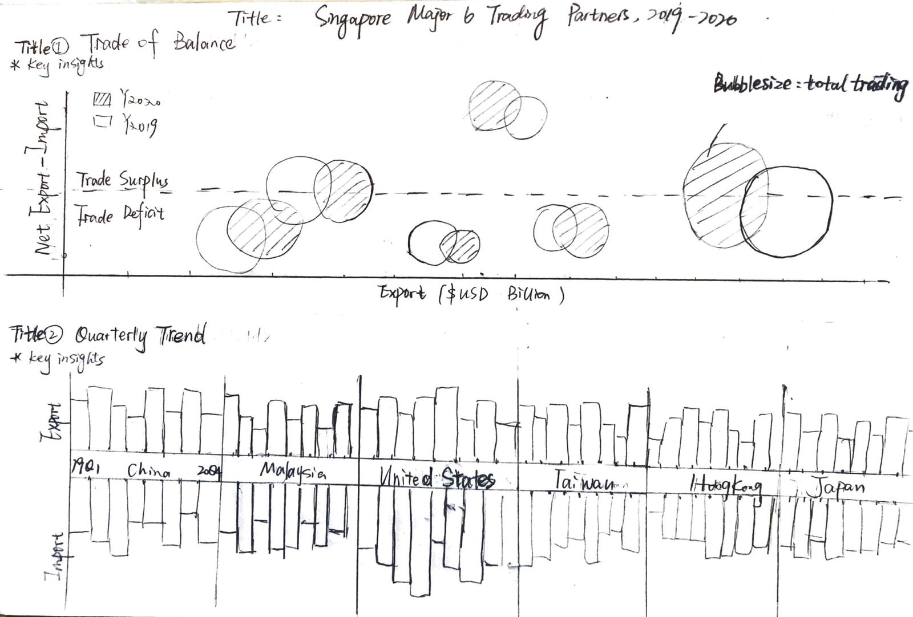
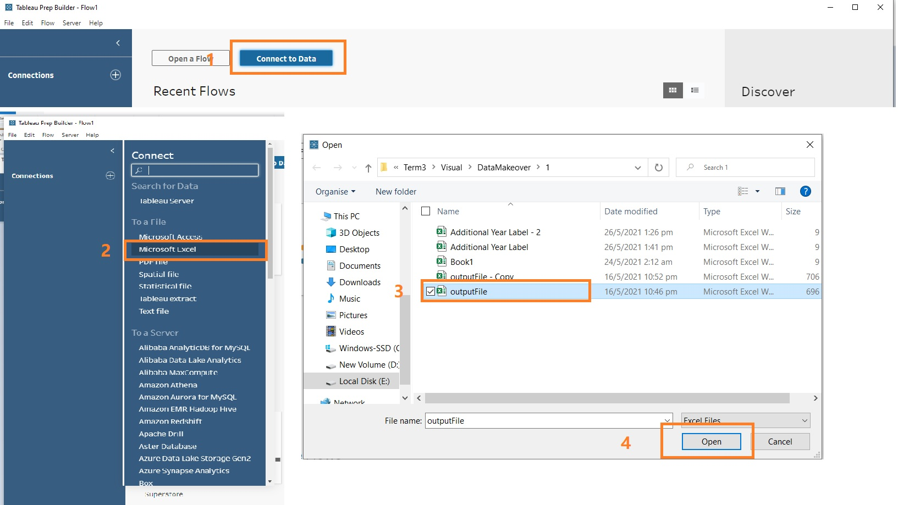
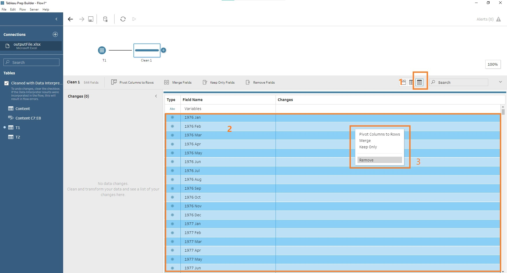
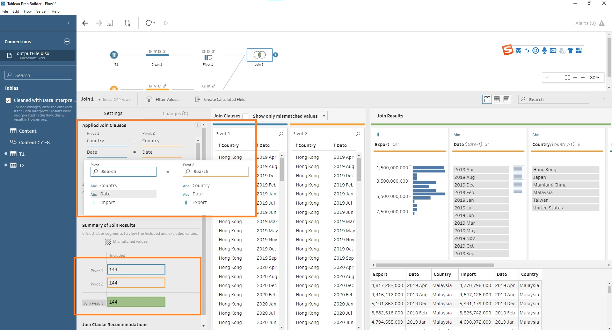

```{r setup, include=FALSE}
knitr::opts_chunk$set(echo = FALSE)

# Learn more about creating blogs with Distill at:
# https://rstudio.github.io/distill/blog.html

```

# 1. Introduction

This is my first data visualization makeover blog. 

The original design (Figure 1.1) used 6 area charts to show monthly fluctuations of Singapore's import and export values with six trading countries. The data is retrieved from [singapore Statistics, Merchandise Trade by Region/Market](https://www.singstat.gov.sg/find-data/search-by-theme/trade-and-investment/merchandise-trade/latest-data).


In this blog, I will explore different perspectives and approaches to improve the original design.


# 2. Asessment of Clarity and Aesthetics in Original Design

In the first stage, let's examine the original visualization in two aspects __Clarity__ and __Aesthetics__.


**Clarity**

  •1.	The title and chart are not consistent. From the charts we cannot tell how “Top Six Trading” is identified and how countries are ranked or compared. Besides, the title period is for period 2019 – 2020, but the charts demonstrate data from 2019 to 2021 on monthly basis.
  
  •2.	The y axis ticks differ from countries as well as import/ export values, hence it is impossible to compare across countries or net import/export values. And within single chart, overlapping areas represent different values which is very misleading.
  
  •3.	There are certain contents missing in the dashboard, for example, currency unit, an important element in measuring values; source of the data, leaving no evidence to support the charts; annotation of key insights, leaving readers not easily understand messages conveyed from the dashboards at first glance.
  
  •4.	The fluctuations of the data in the charts are confusing as x axis represents year, but readers cannot tell the time interval among fluctuations and link to axis values easily.

**Aesthetics**

  •1.	The size of charts is not consistent. Especially, 2019 data is missing for Japan.
  
  •2.	Six area charts used, making each chart too small, and leaving redundant information (such as unnecessary repeated x/y axis labels) and lots of blank areas in overall design.
  
  •3.	The font of the title is not in bold form but x axis, y axis and legend are in bold form, and the size of the title is smaller than individual charts, which lays emphasizes incorrectly. 
  
  •4.	The data label on the right “Measure Names” can be further tuned.

# 3. Alternative Design Sketches and Published Dashboard

To overcome the issues discussed above, here my proposal of design sketches. 



In the alternative design, I plan to use two types of charts. 

__In the top scatter plot__, I would like to compare 3 dimensions, namely, export, net export-import and total trading values. In economics, the concept of balance of trade, calculated by net export (import – export) is widely used. A trade surplus occurs when the result of the net export is positive, while trade deficit occurs when the calculation is negative. Therefore, the net export value is selected as y axis. Then, in order to give a reader a rough overview of the total trading values and comparison between countries and year, the size of bubbles will represent total trading values (export + import) and for each country, there will be 2 bubbles to show 2019 and 2020 values respectively. 

__In the bottom chart__, I plan to compare the quarterly fluctuations of trading values for 6 countries during the period. First of all, to replace monthly fluctuations in original design, I will use quarterly time interval rather than monthly to reveal accurately longer-term economic trends.  Secondly, to avoid misleading overlapping area in the original design, I plan to split export and import values to different charts and reverse the axis of import values, which is also consistent as net export- import calculation as scatter plot. In particular, all y axis and sizes of charts will stay consistent for all charts.
In addition, I will format on the labels, legends, fronts, sizes in the dashboard and add the missing elements, such as currency unit, annotations, key insights etc. into the revised version.

__Clarity__

  •1.	The comparisons are clearer in terms of total trading values/export/net export in the top chart and quarterly trend of export/import values in the bottom chart across countries.
  
  •2.	Readers can easily get the message conveyed of the visualizations through titles and annotations.
  
  •3.	The misleading dual axis is avoided.

__Aesthetics__

  •1.	Two types of the charts are applied to add more insights and colors.
  
  •2.	The format of title, fronts, labels and legends will be revised and improved.
  
  •3.	The overall design of the charts is more organized and redundant information or blank areas will be removed. 

__Additional Insights__

  The net export value, a commonly used economics indicator, is added to the chart to convey clear and straightforward message of trading relationship with Singapore.
  
The final look of the data visualization makeover is  available in [Tableau Public](https://public.tableau.com/app/profile/linya.huang/viz/DataVizMakeover1_16221318674490/DataMakeover).


# 4. Tableau Tutorial Step-by-Step

## 4.1 Data Preparation in Tableau Prep

__4.1.1 Download data from website__

The data is downloaded from sub-section of [Merchandise Trade by Region/Market](https://www.singstat.gov.sg/find-data/search-by-theme/trade-and-investment/merchandise-trade/latest-data). The raw data has 3 tabs, content, T1(import) and T2(export). In both T1 and T2, top 3 rows consists introduction of data and followed by countries/ continents variables , currency unit and values from 1976 January till 2021 March.


__4.1.2 Load data to tableau Prep__

After understanding the raw data structure. Next, let’s launch Tableau Prep Builder and load data.

  •1.click Connect to Data button
  
  •2.select Microsoft Excel on the left bar
  
  •3.locate to target file folder 
  
  •4.confirm and click Open




__4.1.3 Check Data Interpreter__ 

After loading the data, the excel sheets will appear on the left side bar. Then check the box of Use Data Interpreter so that tableau can help to clean the excel workbook , for example, to remove the top 3 rows introduction and locate to the main table in the sheet.


__4.1.4 Initialize Workspace__

  - 1. Drag sheet T1 into work space.
  - 2. Click the round “+” button next to T1
  - 3. Click add Clean Step.


__4.1.5.  Remove Non-target Date Columns__

Since we are only interested in date period from 2019 and 2020, let’s remove those non-target period following the steps below.

  + 1. click show list view
  + 2. select non-target date columns by pressing ‘shift’ key on the keyboard
  + 3. right click and select remove
  


__4.1.6.  Filter Target Countries__

Then, let’s also filter the target countries in column Variables.

  + 1. Click more options “…” next to the Variables column
  + 2. Click 'Filter'
  + 3. Click 'Selected Values'
  + 4. Filter target courtiers by using the 'searching bar'
  + 5. Click 'Done' once finished


__4.1.7 Split Country Names and Currency Unit__

Next, to trim the country name and currency unit, click the [Variable] columns and then click 'Automatic Split button'.


__4.1.8 Remove and Rename Columns__ 

Remove the original [Variable] column and double click [Variable -Split1] to rename it as [Country]. 


__4.1.9. Add Pivot Step__

Ideally, the data structure should be switched to un-pivoted format and reorganized in only 3 columns (date, country and values) for visualization purpose. To achieve this, follow the steps by clicking on the ‘+’ button next to 'Clean 1' step at the workspace area and selecting Pivot option.
 


__4.1.10 Reorganize Data Structure__

Under the Columns to Rows selection, drag all dates into  'Pivoted Fields'. Then all columns are un-pivoted and integrated into 3 = [Pivot Names],[Pivot1 Values] and [Country].


 
 __4.1.11 Create Calculated Filed of Pivoted Values__


As the original values are in thousand units, let’s resume the values by creating a calculated filed.

  •	1. Click Pivot1 Values
  
  •	2. Select Create Calculated Filed button
  
  •	3. Input the Filed Name as Import and formula [Pivot1 Values]*1000
  
  •	4. Click 'Apply' and 'Save' button


__4.1.12 Remove and Rename Pivot Variables__

Then, for final formatting of T1 sheet, let’s rename the filed [Date] by double clicking the column name and remove [Pivot Values].

Similarly, repeat the same data load, Clean 1 and Pivot 1 steps for T2.


__4.1.13 T2 Pivot Calculation__

Repeat same steps in 4.1.11 and 4.1.12. And do note to change the pivoted calculated filed name as ‘Export’.

 

__4.1.14 Join Two Tables-1__

•	1. In the workspace, click on the Pivot 2 and drag it next to Pivot 1. Then,  2 options – Union and Join- will occur as boxes next to Pivot 1. 

•	2. Drag 'Pivot 2' to 'Join' option and let go of the mouse click.


__4.1.15 Join Two Tables-2__

By default, tableau will suggest only one joint clauses for two tables and we need to add another constrain. Make sure 2 clauses-Country and Date- are added here.

To confirm the output, as shown below, there will be 144 items matched with each other. (Joint result should be 6 countries * 24 months= 144 items in total)



__4.1.16 Remove Repeated Join Columns__

Last but not the least, remove the repeated join columns [Date] and [Country].


__4.1.17 Data Preparation Final Look__

Bingo! Here we have completed the data cleaning!


__4.1.18 Add Output Step__

Move on, we have to add output step to get the tableau file.


__4.1.19 Data Preparation Output - Run Flow__


  •	1. Click on Browse
  
  •	2. Locate to the file location, change the File name as ‘cleaned_data_import_export’
  
  •	3. Click Run Flow button


Finally, we manage to get the cleaned data in tableau extract format.


## 4.2 Data Makeover in Tableau Desktop


Next, let’s make the final visualization in desktop step by step.

__4.2.1 Data Launch in Tableau Desktop__

To start,

  •1.Launch Tableau Desktop, click on 'file' in the menu bar. 
  
  •2.Select 'Open' in the drop-down list.
  
  •3.Locate to ‘cleaned_data_import_export’ file location , confirm and click 'Open 'button.


__4.2.2. Change Date Format__

After importing the data, noticed that date is still in string format.  To modify, hover mouse to 'Abc' icon, click and chose 'Date' in the drop-down list. Then, the date will be changed as ‘dd/mm/yyyy’ format.


__4.2.3 Tableau Desktop Layout__

Here we are at the Tableau Desktop working station. 


**Scatter Plot**

__4.2.4 Create Net Export Calculated Field__


  •	1.Double click ‘sheet1’ and rename it as ‘Scatter Plot’
  
  •	2. Hover mouse to blank area of the Data Pane, right click and select ‘Create Calculated Field…’
  
  •	3. In the formula window, add new variable name -Net Export-Import($SGD Billion)-and formula [Export]-[Import], confirm and click Apply and Save button.


__4.2.5 Drag Columns and Rows to Scatter Plot__

Drag Columns and Rows to top shelves.


__4.2.6 Create Bubble Label Calculation Field__

Similarly, create another calculation filed as ‘Bubble Label’ to achieve customized bubble colors.


__4.2.7 Create Total Trading Values Calculation Filed__

Then, create one more calculation filed ‘Total Trading Values($SGD Billion)’ by adding ‘[Export]+[Import]’ values


__4.2.8 Add Color and Size to Bubbles__

  •1. Drag ‘Bubble Label’ and ‘Total Trading Values($SGD Billion)’ to 'Marks' area as Color and Size respectively. 
  
  •2. Click on 'Size' icon and drag the slicer to change the bubble size.


__4.2.9 Sort Bubble Legends__

  •1. Click Edit icon for the ‘Bubble Label’ Legend on the right
  
  •2. Select Sort option in the drop-down list
  
  •3. In Sort window, select ‘Manual’ in the drop-down list
  
  •4. Sort the value based on the year and total trading value in descending orders


__4.2.10 Change Bubble Colors__

  •1.Similarly, select 'Edit Colors' for ‘Bubble Label’ Legend on the right
  
  •2. Choose a color Palette – 'Tableau 20'
  
  •3. Click on each legend and update the colors
  
  •4. Click 'Apply' and 'OK' once done 


__4.2.11 Format Bubble Boarders__

To add boarders to the bubble and change to solid color fill,

  •1. Click drop-down list and select ‘Circle’
  
  •2. Click Color and change the opacity and boarder options


__4.2.12 Add More Labels__


Drag more labels (‘Country’ and ‘Date’) to the charts.

Now we have a first draft of the scatter plot! 

Let’s leave as it is now and move on. We will come back later and adjust format.


__Bar Charts__

__4.2.13 Add Bar Chart for China(Export)__

Then, we continue to build bar chart sheets for the bottom part.

  •1. Create a new work sheet named ’China(Export)’
  
  •2. Drag [Export] to Rows and [Date] to Columns. Click drop-down list from [Date] and select 'Quarter' Option
  
  •3. In the marks filed, select 'Bar' option
  
  •4. Drag [Country] to Filters filed 
  
  •5. In the filter window, check the box of  ‘Mainland China’ and click ‘OK’ button


__4.2.14 Format Bar Chart for China(Export)__

Subsequently, let’s adjust the formatting of the sample bar chart.

  •1. Hover mouse to the title area, right click and select ‘Hide title’
  
  •2. Hover mouse to x axis area, right click and un-check ‘Show Header’
  
  •3. Hover mouse to any chart area, right click and select ‘Format’ option
  
  •4. On the left pane, locate to rows and update ‘Grid Lines’ option as None in drop-down list

[Figure 4.2.15 Format Bar Chart for China(Export) - Bar Chart](images/1/Figure 4.2.15 Format Bar Chart for China_Export.jpg)


__4.2.15 Duplicate Export Chart for Other Countries__

  •1. Right click on ‘China(Export)’ sheet in the bottom, select 'duplicate'
  
  •2. Rename the duplicate sheet as ‘<Country>(Export)’, and change the filter accordingly
  
  •3. Update the color of the bar same as scatter plot color palette
  
  •4. Hover to the y axis area and un-check ‘Show Header’
  
  •5. Repeat the same steps for other countries and eventually get 6 ‘<Country>(Export)’ bar charts 


__4.2.16 Add Bar Chart for China(Import)__

Repeat similar steps in creating export chart and create first Import chart for China, but take note that in step 4 and 5 to fix y axis and reverse it.

[Figure 4.2.16 Add Bar Chart for China(Import) - Bar Chart](images/1/Figure 4.2.17 Add Bar Chart for China_Import- Bar Chart.jpg)

__4.2.17 Duplicate Import Chart for Other Countries__

Similarly, duplicate the steps for other countries. And you will get 6 export and 6 import sheets in total.


__4.2.18 Initialize Layout of Dashboard__

Subsequently, create a new dashboard and drag sheets and text objects to the workspace. Then, format the size and layout accordingly.


__4.2.19 Add Quarterly Import Shift__

After plotting all bar charts in dashboard, it is observed that a shift occurs in 19Q4 and 20Q1, hence, we can highlight this trend by add customized colors into the bar charts with below steps.

  •1. Create another calculation filed ‘shift’ with formula - IF [Date]>DATE("30-09-2019") AND [Date]<DATE("01-04-2020") THEN [Country]+"1" ELSE [Country]+"0" END
      
  •2. Add the measure to color marks 
  
  •3. Edit colors of the legend

Similarly, drag such measure to other import charts and update colors.


__4.2.20 Add Annotation__

  •1. Right click blank area in of the scatter plot, select ‘Annotate' >> 'Point’
  
  •2. In the ‘Edit Annotation’ window, input the value
  
  •3. Format the annotation by removing default ‘Shading’ and ‘Line’


__4.2.21 Add More Annotations__

Noted the label we added before is not good enough. After observing more insights from the data. Again, repeat the steps and manually add more annotations.


__4.2.22 Add Customized Year Legends__

  •1. Create a excel file as shown in the screen shoot
  
  •2. Import the sheet in the tableau desktop and drag year to ‘Marks>>Color’
  
  •3. Edit color accordingly


__4.2.24 Add Customized Year Legends to Dashboard__


For the final step,

  •1. Drag the ‘Year Label’ sheet to main dashboard; Change the status to ‘Floating’ by clicking the reversed triangle icon
  
  •2. Remove default ‘Worksheet’ settings
  
  •3. Add ‘Annotations>>Marks’ as we did in previous steps


**Bravo! We have completed the dashboard!**


# 5. Major Observations 


•1. From the scatter plot, we understand that Singapore’s largest leading merchandise partners are Mainland China, Malaysia and United States with total trading value over 100 Billion SGD dollars, especially Mainland China at 137 Billion.

•2. With the reference line in the middle of scatter plot as well as different colors, we can tell that Singapore has trade plus with Mainland China, United States, Hong Kong and Japan in year 2020, while trade deficit with Malaysia and Taiwan. In particular, the total export values changed significantly for US and Malaysia that United States switched from trade deficit to trade surplus in year 2020 and merchandise export to Malaysia decreased significantly (at 18%). 

•3. In the Quarterly Trend chart, for export values, significant drops are observed for China and Malaysia in 19Q4 to 20Q1 while there is upward trend for US, Hong Kong and Taiwan in general. For import values, during 19Q4 to 20Q1, Singapore's merchandise import shrank with all major partners except Japan.


Thank you for reading up to this point! 

That's all for my first blog.


